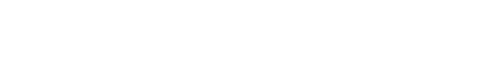
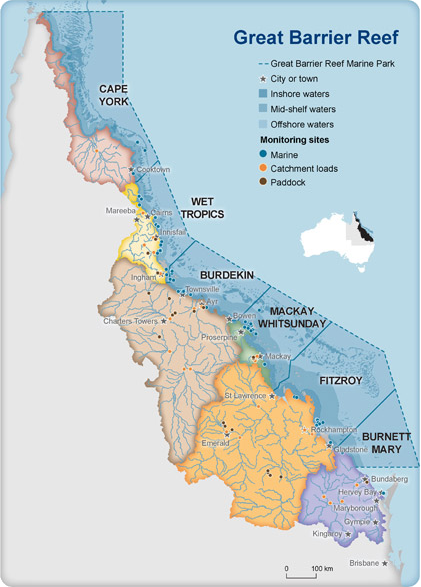
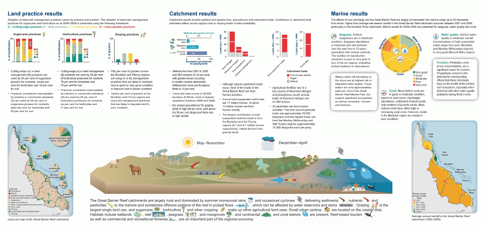
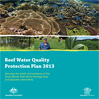
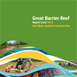
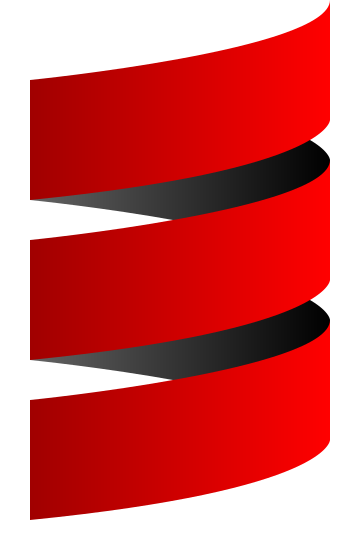
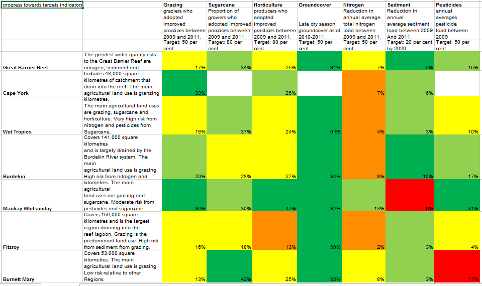
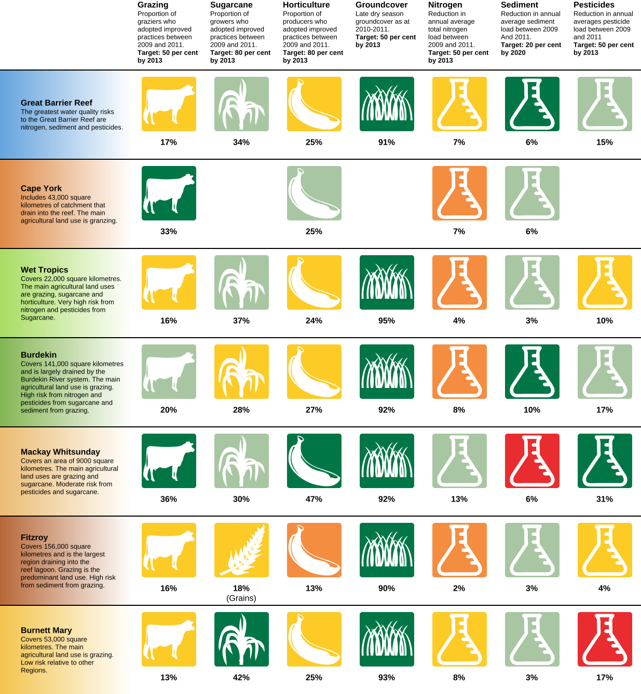
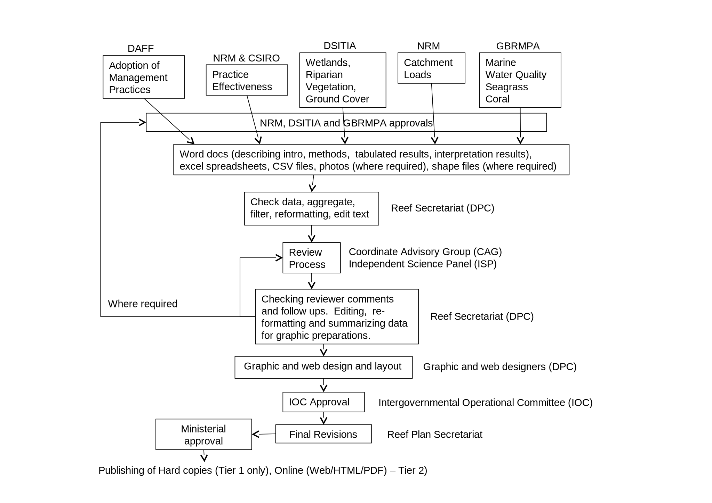
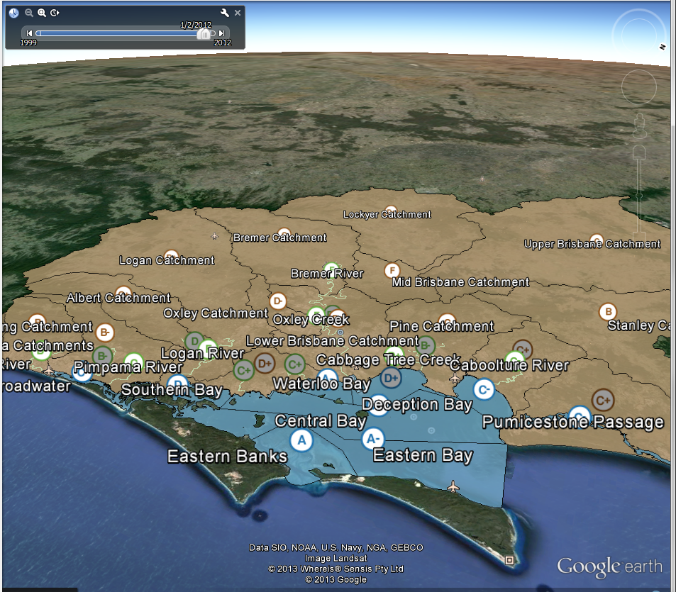

<section data-background="images/bg.jpg"><!--
Background attribution:

The background for this page was derived from an original image
(http://www.flickr.com/photos/sackerman519/4251310991/)
by Sarah Ackerman (http://www.flickr.com/photos/sackerman519/) and is used
under her Some Rights Reserved licence
(http://creativecommons.org/licenses/by/2.0/).
-->

  <h1>
    AORRA
    <small>Automating Reef Report Cards</small>
  </h1>
     
  <h2>
    Tim Dettrick, Andre Gebers, Jane Hunter
     
    The University of Queensland
  </h2>
   
  <h3>
    <small>Part of the larger</small>
    

    
    eReefs
    
    

    <small>Project</small>
  </h3>

   
  <h5>
    <strong>Note:</strong>
    This browser doesn't support this presentations 3D transforms, and
    probably won't support the WebM videos later on.
  </h5>

  
<aside class="notes" data-markdown="">
My name is Tim Dettrick - I'm a software engineer at the University of
Queensland working on the AORRA project.

The goal of the AORRA project is to improve the delivery of annual reports
relating to the health of the Great Barrier Reef. By automating repetitive
manual steps required for their creation, we hope to reduce the delays and
improve their quality.
</aside>
</section>

---

## “Reef Report Card”?

Note:
So, a quick background on what these reef report cards are...

Water pollution is currently a threat to the Great Barrier Reef. It has 
forty catchments and a total
catchment area of more than four hundred thousand square kilometres, and many
of the waterways in the catchment area contain significant sediment and
chemical run-off from farming and grazing. This pollution is detrimental
in a number of ways, from interfering with coral development to increasing the
outbreaks of coral eating starfish.

### 2009 - Reef Water Quality Protection Plan

Long term goal:
> **To ensure that by 2020 the quality of water entering the reef from
broadscale land use has no detrimental impact on the health and resilience of
the Great Barrier Reef.**

Sets water quality and land management targets required to meet the long-term
goal.

Note:
The Reef Water Quality Protection Plan is a collaborative program designed to
improve the quality of the Great Barrier Reef through improved land management
practices in reef catchments. It is a joint commitment between the Australian
and Queensland Governments.

The long term goal is to ensure that by 2020 the quality of water entering the
the reef has no detrimental impact on its health. It sets specific actions and
deliverables to be completed by 2018.

### Reef Report Card

Reports on progress towards those targets, using measurements taken on a
(mostly) annual basis.

Note:
Reef report cards are issued for each calendar year, tracking progress against
the 2009 baseline measurements. Metrics include:

 - % of farmers who have adopted best practice land management
 - % coverage of groundcover and riparian vegetation
 - catchment pollution loads
 - marine coral health, sea-grass abundance and water quality

The report cards provide a scientific basis for assessing the effectiveness of
the protection plan.

They contain analysis based on reports and data provided by a number of
Queensland and Federal Government agencies, including:

 - Department of Natural Resources & Mines (DNRM);
 - Department of Agriculture, Fisheries and Forestry;
 - Great Barrier Reef Marine Park Authority;
 - Deparment of Science, Information Technology, Innovation and the Arts; &
 - CSIRO

These reports and collected data are processed by the Reef Secretariat under
the Department of Premier and Cabinet to produce regular report cards.

### Released so far

*Baseline* 2009 → Released August 2011

*2nd* 2010 → Released April 2013

*3rd* 2011 → Released July 2013

 → 

Note:
To provide the most useful feedback into how the plan should be implemented,
report cards should closely follow the completion of data collection. However,
analysis of the raw data by relevant agencies takes considerable time, as does
collation and publishing.

Media coverage (and resulting public engagement) also benefits from timely
delivery of new report cards. The "current" health of the reef will generally
be of more public interest than its "historical" health. As demonstrated by
the 2011 report, extreme weather events impact water quality a great deal,
making data collected prior to them decidedly less "current".

---

## Why automate?

<ul class="unstyled">
  <li>
    &#9193; Produce reports faster
  </li>
  <li>
    &#x2611;
    Reduce data-entry errors / improve quality assurance
  </li>
  <li>
    &#x267B; Data sharing/re-use
  </li>
  <li>
    &#x231B; Long term access and preservation
  </li>
</ul>

Note:
So, we want to automate the process of creating reef report cards.

The central reason is that we believe if we can reduce the number of manual,
repetitive steps involved, then the reports can be produced faster. This is a
fairly straight-forward proposition, though we obviously need to be careful
that the system doesn't introduce more work than it saves.

There's another good reason to automate some of these steps though. Every time
you manually copy data from one document to another, you raise the possiblity
of incorrectly re-entering it. During our initial prototyping, we automated
the generation of key charts in the reports and used a simple web-based form
to populate them. As we increased the data points in the charts, we noticed
that it became increasingly difficult to produce charts without transposing
or miscopying values. Automation should reduce data entry errors and improve
QA.

By putting report card data into an online system, we're also improving
tracking of that data. That gives us opportunities to share and reuse data,
and it also lets us improve long-term access and preservation of that data.

---

## Our work so far

 

#### Document Management

#### +

#### Chart Generation

Note:

So, now that the background is out of the way, let's take a look at what we've
done so far.

Our scoping study identified the need for centralised document management.
Most documents suppilied from contributing agencies are supplied as Microsoft
Word and Excel files. The documents often goes through multiple iterations of
feedback and improvement, which had led to "version control by email".

As discussed earlier, we also identified a need to automatically generate the
charts which are included in each report card. The graphic design work
involved in creating these charts manually was time intensive, and meant that
contributors were often limited to simple Excel-based charts when producing
their analyses.

The system we've built so far is best characterised as a fairly standard
Document Management System with a number of domain-specific extensions. Our
scoping study identified existing software we could have extended, however we
soon discovered we had a problem:

The best **simple** open-source document management systems tend to be written
in PHP. The best open-source chart tools are written in Java. PHP to Java
bridges are of course great ways to spend weeks of your time worrying about
interoperability issues.

During the scoping study we'd already written Java-based chart libraries, so
we took a brief look at Java-based Document Management Systems... all of which
seemed to be aimed at enterprises with thousands of users and small army of
developers to extend them.

In the end we decided that it couldn't be all that hard to write our own
simple document management system - at least one that would provide the
functionality required - and that having control of the entire code-base would
make integrating domain-specific features easier.

### Tech we're using

+

+

... and quite a bit more:

[Batik][batik] ✧ [POI][poi] ✧ [Tika][tika] ✧ [docx4j][docx4j] ✧
[JFreeChart][jfc] ✧ [CRaSH][crash]

[batik]: http://xmlgraphics.apache.org/batik/
[crash]: http://www.crashub.org/
[docx4j]: https://github.com/plutext/docx4j
[jfc]: http://www.jfree.org/jfreechart/
[poi]: http://poi.apache.org/
[tika]: http://tika.apache.org/

Note:

So, having decided we needed our own document management system, we thought
we'd follow the lead of other document management systems and build on top of
a Java Content Repository implementation. In our case - Apache Jackrabbit.

We'd tied ourselves to the JVM, but we didn't actually need a servlet
container for anything we'd be using, so we opted for the Play Framework.
It's not quite as quick to develop with as Ruby's Rails or Python's Django,
but for a Java-based framework it's not bad.

Finally, as Play Framework is built by Typesafe, which was founded by the
creators of the Scala programming language, we were able to mix in Scala
where it made sense. Neither myself or by colleague Andre Gebers had ever used
Scala on a project before, so we limited how much we used it, but it certainly
helped improve some collaborative features of the system.

### Data Input Formats

Excel spreadsheets, not machine-friendly XML

Note:

**Good news**: contributors supply their data as XML!

**Bad news**: that's only because Microsoft Office documents are
zipped bundles of XML these days.

Rather than try to change that, we worked with Reef Secretariat to specify
some standard formats for supplied spreadsheets, and then set to work
on extracting the data we needed from them.

Apache POI makes extracting spreadsheet data fairly straight-forward, though
reading cell colours is a little temperamental when dealing with spreadsheets
saved by non-Microsoft office suites. Fortunately, we as developers were the
only people not regularly using Microsoft Office, so that wasn't a big deal.

### Vector Charts

Data extraction, processing & graphics generation

Note:

Having extracted the data we then used a combination of Java's AWT libraries,
Apache Batik and JFreeChart to produce vector-based charts.

This example just uses AWT and Batik, though other more conventional charts
use JFreeChart.

### Not a workflow system

System assists the process, rather than changing it.

Note:

It's sometimes tempting to build workflow management into a system, to better
"manage the process". There really aren't any good reasons to do that here
though. There aren't many people involved once the raw data has been processed
and analysed, and everybody talks to each other to sort out problems.

In fact, we've set out to avoid incorporating processes whenever possible.
There's no fixed data hierarchy and only a minimal folder-based permission
system. That limits how much we can automate assembling a final report card,
but it also removes problems like "only reporting riparian data every 4th
year".

### Chart creation

<video class="webm-video" style="height: 14em" controls>
  <source src="video/chart.webm"/>
</video>

Note:

So, time for a demo. [start video]

AORRA is a modern web app, using asynchronous background requests to update
the user interface.

In this screencast we see files being uploaded as a group to AORRA, and we
flip through the generated charts.

All the charts are downloadable as a single archive, including vector and
raster formats suitable for print and web publication.

To demonstrate versioning, we upload the file again. Once we're done, we
delete the file.

### Real-time notifications

<video class="webm-video" style="height: 16em" controls>
  <source src="video/notifications.webm"/>
</video>

Note:

To aid collaboration, AORRA provides real-time notifications of other user
activity. [start video]

This screencast shows two different users logged, and how one user's actions
can be watched by another.

The top user navigates to a file and decides to watch it for changes. The
bottom user navigates to the same file, and indicates they are editing the
file by clicking "Edit".

This action immediately updates the related counter for both users. It also
adds a new notification message. The top user marks it as read.

The bottom user uploads a new version of the file, and a notification
immediately appears for the top user. The top user reads the new notification,
and then deletes all of them.

---

## What's next?

<ul class="unstyled">
  <li>
    &#x1f4ca;
    Web-focused charts &amp; infographics
  </li>
  <li>
    &#x1F30F;
    Geospatial data
  </li>
  <li>
    &#x1f4ac;
    Online editing and collaboration
  </li>
</ul> 

Note:

So, what's next?

Up until now Reef Secretariat have been focused on print-format report cards,
with their website reusing the print assets. We'd like to start targeting the
web, producing interactive charts and infographics to engage the public.

We'd also like to integrate geospatial data, to give people the ability to
drill down on a map and look at how different regions are faring.

On the production side of things, we'd also like to reduce the reliance on 
Word documents for report card production.

## Challenges ahead

Linking report cards to raw data.

Note:

Ultimately if we're going provide the ability to drill down using geospatial
data we'd like to go all the way back to the raw data. The Health-e-Waterways
project does something similar already.

This will be a significant challege, because Reef Secretariat doesn't
currently receive anything close to the raw data. Even the source data for
their spreadsheets has generally been aggregated already, in many cases by
internal software used by the contributors.

As a result, we're planning to slowly work out way down while we work through
how to acquire and associate lower-level data with higher-level report
results.

## Longer-term

Integrating with eReefs to do it with web services.

<h3 style="padding-top: 1em;">
eReefs → 

  ?
  ?
  ?

 ← AORRA
</h3>

Note:

Longer-term we'd like AORRA to receive that lower-level data from the larger
eReefs project, which is working to produce web data services for this data.

Realistically though this ia a long-term aspiration. eReefs has a phased
development out to 2016, and their APIs will have to provide up-to-date data
from operational systems before we can use them. For now, AORRA is very much
focused on providing tools to improve reporting in the short-term while a
longer-term solution emerges.

---

# Questions ?

[@tjdett][twitter]

[uq-eresearch.github.io/aorra-eresearch-2013][slides]

[twitter]: http://twitter.com/tjdett
[slides]: http://uq-eresearch.github.io/aorra-eresearch-2013

