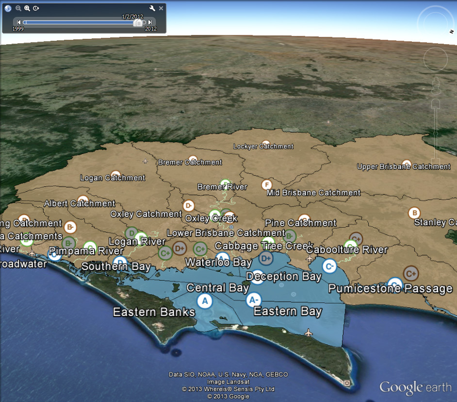

<section data-background="images/bg.jpg"><!--
Background attribution:

The background for this page was derived from an original image
(http://www.flickr.com/photos/sackerman519/4251310991/)
by Sarah Ackerman (http://www.flickr.com/photos/sackerman519/) and is used
under her Some Rights Reserved licence
(http://creativecommons.org/licenses/by/2.0/).
-->

  <h1>
    AORRA
    <small>Automating Reef Report Cards</small>
  </h1>
     
  <h2>
    Tim Dettrick, Andre Gebers, Jane Hunter
     
    The University of Queensland
  </h2>
   
  <h3>
    <small>Part of the larger</small>
    

    
    eReefs
    
    

    <small>Project</small>
  </h3>

   
  <h5>
    <strong>Note:</strong>
    This browser doesn't support this presentations 3D transforms, and
    probably won't support the WebM videos later on.
  </h5>

<aside class="notes" data-markdown="">
 - Name
 - Software engineer at UQ eResearch Lab working on the AORRA project.

The goal of the AORRA project: "improve the delivery of annual reports
relating to the health of the Great Barrier Reef". 

automating repetitive manual steps → reduce delays and improve the quality
</aside>
</section>

---

## “Reef Report Card”?

Note:
So, a quick background on what these reef report cards are...

 - Water pollution - major threat to Great Barrier Reef. 
 - 40 catchments across 400 thousand square kilometers
   - waterways in the catchment area contain significant sediment and
chemical run-off from farming and grazing.
   - contaminated water → reef
 - detrimental in a number of ways
   - interfering with coral development
   - increasing the outbreaks of coral eating starfish

### 2009 - Reef Water Quality Protection Plan

Long term goal:
> **To ensure that by 2020 the quality of water entering the reef from
broadscale land use has no detrimental impact on the health and resilience of
the Great Barrier Reef.**

Sets water quality and land management targets required to meet the long-term
goal.

Note:
Reef Water Quality Protection Plan is a collaborative program designed to
improve the quality of water feeding into the Great Barrier Reef through
improved land management practices in reef catchments. 

Joint commitment between the Australian and Queensland Governments.

Long term goal: "ensure that by 2020 the quality of water entering the
the reef has no detrimental impact on its health"

Sets specific actions and deliverables to be completed by 2018.

### Reef Report Card

Reports on progress towards those targets, using measurements taken on a
(mostly) annual basis.

Note:
 - Reef report cards are issued for each calendar year
 - tracking progress against the 2009 baseline measurements. 

Metrics include things like:

 - the % of farmers who have adopted best practice land management
 - % of coverage for groundcover and riparian vegetation
 - catchment water pollution loads
 - marine coral health & sea-grass abundance and
 - water quality out on the reef.

Report cards: a scientific basis for assessing the effectiveness

Contain analysis based on reports and data provided by a number of
Queensland and Federal Government agencies:

 - Department of Natural Resources & Mines (DNRM);
 - Department of Agriculture, Fisheries and Forestry;
 - Great Barrier Reef Marine Park Authority;
 - Deparment of Science, Information Technology, Innovation and the Arts; &
 - CSIRO

Reports and collected data are processed by the Reef Secretariat under DP&C.

### Released so far

*Baseline* 2009 → Released August 2011

*2nd* 2010 → Released April 2013

*3rd* 2011 → Released July 2013

 → 

Note:
most useful feedback: closely follow the completion of data collection

Analyis of the raw data by relevant agencies takes considerable time, as does
collation and publishing.

Media coverage (and resulting public engagement) also benefits from timely
delivery of new report cards. 

Interest: "current" health of the reef > its "historical" health

2011 report: extreme weather events heavily impacted water quality

---

## Why automate?

<ul class="unstyled">
  <li>
    &#9193; Produce reports faster
  </li>
  <li>
    &#x2611;
    Reduce data-entry errors / improve quality assurance
  </li>
  <li>
    &#x267B; Data sharing/re-use
  </li>
  <li>
    &#x231B; Long term access and preservation
  </li>
</ul>

Note:
So, we want to automate the process of creating reef report cards.

central reason: we believe if we can reduce the number of manual,
repetitive steps involved, then the reports can be produced faster.

Fairly straight-forward proposition - must be careful
that the system doesn't introduce more work than it saves.

Another good reason to automate:

 - manual copying → incorrect reentry
 - initial prototyping: automated generation of key charts with simple form
 - increased the data points in the charts → increasingly no. errors

Report card data into an online system → improving tracking of that data.

Gives us opportunities to share and reuse data, and it also lets us improve 
long-term access and preservation of that data.

---

## Our work so far

 

#### Document Management

#### +

#### Chart Generation

Note:

So, now that the background is out of the way, let's take a look at what we've
done so far.

Scoping study identified the need for centralised document management.

Most documents supplied by contributing agencies → Microsoft Word & Excel.

 - multiple iterations of feedback and improvement
 - "version control by email".

discussed earlier - identified need to automatically generate charts

 - graphic design work → time intensive,
 - contributors limited to simple Excel-based charts when producing analyses

System so far - best characterised as a simple Document Management System 
with a number of domain-specific extensions.

Scoping study identified existing software we could have extended.

A problem emerged:

 - best **simple** open-source document management systems → PHP
 - best open-source chart tools → Java
 - PHP to Java bridges → probably not a good move

Already had Java-based chart libraries from scoping study

 - brief look at Java DMS
 - all seemed aimed at enterprises with:
   - thousands of users, and 
   - small army of developers to extend them.

In the end, we decided to write own DMS

 - simple → functionality required
 - having control of the entire code-base → integrating easier

### Tech we're using

+

+

... and quite a bit more:

[Batik][batik] ✧ [POI][poi] ✧ [Tika][tika] ✧ [docx4j][docx4j] ✧
[JFreeChart][jfc] ✧ [CRaSH][crash]

[batik]: http://xmlgraphics.apache.org/batik/
[crash]: http://www.crashub.org/
[docx4j]: https://github.com/plutext/docx4j
[jfc]: http://www.jfree.org/jfreechart/
[poi]: http://poi.apache.org/
[tika]: http://tika.apache.org/

Note:

So, having decided we needed our own document management system, we thought
we'd follow the lead of other document management systems and build on top of
a Java Content Repository implementation. In our case - Apache Jackrabbit.

We'd tied ourselves to the JVM, but we didn't actually need a servlet
container for anything we'd be using, so we opted for the Play Framework.
It's not quite as quick to develop with as Ruby's Rails or Python's Django,
but for a Java-based framework it's not bad.

Finally, as Play Framework is built by Typesafe, which was founded by the
creators of the Scala programming language, we were able to mix in Scala
where it made sense. Neither myself or by colleague Andre Gebers had ever used
Scala on a project before, so we limited how much we used it, but it certainly
helped improve some collaborative features of the system.

### Data Input Formats

Excel spreadsheets, not machine-friendly XML

Note:

**Good news**: contributors supply their data as XML!

**Bad news**: that's because MS Office documents are zipped bundles of XML.

Rather than try to change that...

We worked with Reef Secretariat to specify some standard formats for supplied
spreadsheets, and then set to work on extracting the data we needed from them.

Apache POI makes extracting spreadsheet data fairly straight-forward
 - reading cell colours is a little temperamental w/ non-MS office suites 
 - fortunately, only developers using those

### Vector Charts

Data extraction, processing & graphics generation

Note:

Having extracted the data we then used a combination of Java's AWT libraries,
Apache Batik and JFreeChart to produce vector-based charts.

Example just uses AWT and Batik - more conventional charts use JFreeChart.

### Not a workflow system

System assists the process, rather than changing it.

Note:

It's sometimes tempting to build workflow management into a system, to better
"manage the process".

Aren't any good reasons to do that here:

 - not many people involved once the raw data has been processed
 - email workflow already → everybody already talking to each other

Set out to avoid incorporating processes whenever possible:

 - no fixed data hierarchy 
 - minimal folder-based permission system
 
Limits how much we can automated assembly → avoids need to understand as many
business rules.

### Chart creation

<video class="webm-video" style="height: 14em" controls>
  <source src="video/chart.webm"/>
</video>

Note:

So, time for a demo. [start video]

AORRA is a modern web app, using asynchronous background requests to update
the user interface.

In this screencast:

 - files being uploaded as a group to AORRA
 - flip through the generated charts
 - all the charts are downloadable as a single archive
   - vector formats (SVG, EMF)
   - raster formats (PNG)
   - suitable for print and web publications
 - demonstrate versioning: we upload the file again
 - delete the file

### Real-time notifications

<video class="webm-video" style="height: 16em" controls>
  <source src="video/notifications.webm"/>
</video>

Note:

To aid collaboration, AORRA provides real-time notifications of other user
activity. [start video]

This screencast shows two different users logged in:

 - top user
   - navigates to a file
   - watch it for changes
 - bottom user
   - navigates to the same file
   - indicates they are editing the file by clicking "Edit"
     - immediately updates the related counter for both users
     - adds a new notification message
 - top user
   - marks the notification as read
 - bottom user
   - uploads a new version of the file
     - notification immediately appears
 - top user
   - reads the new notification
   - deletes all notifications

---

## What's next?

<ul class="unstyled">
  <li>
    &#x1f4ca;
    Web-focused charts &amp; infographics
  </li>
  <li>
    &#x1F30F;
    Geospatial data
  </li>
  <li>
    &#x1f4ac;
    Online editing and collaboration
  </li>
</ul> 

Note:

So, what's next?

Reef Secretariat have been focused on print-format report cards

 - website reusing the print assets
 - start targeting the web → interactive charts and infographics

integrate geospatial data - drill down on a map

Production side - like to reduce the reliance on Word documents

## Challenges ahead

Linking report cards to raw data.

Note:

Ultimately if we're going provide the ability to drill down using geospatial
data we'd like to go all the way back to the raw data. The Health-e-Waterways
project does something similar already.

This will be a significant challege:

 - Reef Secretariat doesn't receive anything close to the raw data. 
 - source data for spreadsheets → generally aggregated already
 - aggregated by contributor software systems

Plan: slowly work out way down.

## Longer-term

Integrating with eReefs to do it with web services.

<h3 style="padding-top: 1em;">
eReefs → 

  ?
  ?
  ?

 ← AORRA
</h3>

Note:

Longer-term we'd like AORRA to receive lower-level data from the larger
eReefs project, which is working to produce web data services for this data.

Realistically though this is a long-term aspiration. eReefs has a phased
development out to 2016, and their APIs will have to provide up-to-date data
from operational systems before we can use them.

For now, AORRA is very much focused on providing tools to improve reporting
in the short-term while a longer-term solution emerges.

---

# Questions ?

[@tjdett][twitter]

[uq-eresearch.github.io/aorra-eresearch-2013][slides]

[twitter]: http://twitter.com/tjdett
[slides]: http://uq-eresearch.github.io/aorra-eresearch-2013

Note:

 - So, that concludes my talk.
 - Thanks for your time.
 - slides & videos - link or QR code

Does anybody have any questions?

